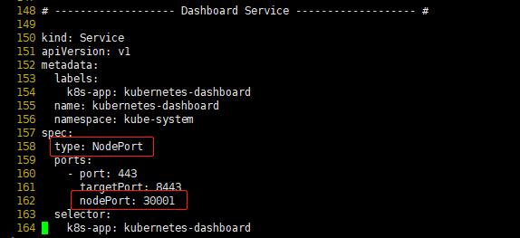

- [安装要求](#安装要求)
- [学习目标](#学习目标)
- [准备环境](#准备环境)
- [所有节点安装Docker/kubeadm/kubelet](#所有节点安装dockerkubeadmkubelet)
    - [安装Docker](#安装docker)
    - [添加阿里云YUM软件源](#添加阿里云yum软件源)
    - [安装kubeadm，kubelet和kubectl](#安装kubeadmkubelet和kubectl)
- [部署Kubernetes Master](#部署kubernetes-master)
- [加入Kubernetes Node（Node节点操作）](#加入kubernetes-nodenode节点操作)
- [安装Pod容器网络插件（CNI）](#安装pod容器网络插件cni)
- [测试kubernetes集群](#测试kubernetes集群)
- [部署 Dashboard](#部署-dashboard)

kubeadm是官方社区推出的一个用于快速部署kubernetes集群的工具。
这个工具能通过两条指令完成一个kubernetes集群的部署：

```shell
# 创建一个 Master 节点
$ kubeadm init
 
# 将一个 Node 节点加入到当前集群中
$ kubeadm join < Master节点的IP和端口 >
```

# 安装要求
在开始之前，部署Kubernetes集群机器需要满足以下几个条件：
+ 一台或多台机器，操作系统 CentOS7.x-86_x64
+ 硬件配置：2GB或更多RAM，2个CPU或更多CPU，硬盘30GB或更多
+ 集群中所有机器之间网络互通 可以访问外网，需要拉取镜像
+ 禁止swap分区

# 学习目标
1. 在所有节点上安装Docker和kubeadm
2. 部署Kubernetes Master
3. 部署容器网络插件
4. 部署 Kubernetes Node，将节点加入Kubernetes集群
5. 部署Dashboard Web页面，可视化查看Kubernetes资源

# 准备环境
Kubernetse架构图


```shell
关闭防火墙：
$ systemctl stop firewalld
$ systemctl disable firewalld
 
关闭selinux：
$ sed -i 's/enforcing/disabled/' /etc/selinux/config
$ setenforce 0
 
关闭swap：
$ swapoff -a  $ 临时
$ vim /etc/fstab  $ 永久
 
设置主机名称
$ hostnamectl set-hostname master
$ hostnamectl set-hostname node1
$ hostnamectl set-hostname node2

添加主机名与IP对应关系（记得设置主机名）： 
$ cat /etc/hosts
192.168.50.201 master
192.168.50.202 node1
192.168.50.203 node2
 
将桥接的IPv4流量传递到iptables的链： 
$ cat > /etc/sysctl.d/k8s.conf <<EOF
net.bridge.bridge-nf-call-ip6tables = 1
net.bridge.bridge-nf-call-iptables = 1
EOF

$ sysctl --system
```

# 所有节点安装Docker/kubeadm/kubelet
Kubernetes默认CRI（容器运行时）为Docker，因此先安装Docker。 
## 安装Docker
1. 如果你之前安装过 docker，请先删掉
```shell
sudo yum remove -y docker docker-common docker-selinux docker-engine
```
2. 安装一些依赖
```shell
sudo yum install -y yum-utils device-mapper-persistent-data lvm2
```
3. 根据你的发行版下载repo文件：
CentOS:
```shell
wget -O /etc/yum.repos.d/docker-ce.repo https://download.docker.com/linux/centos/docker-ce.repo
```
4. 把软件仓库地址替换为TUNA：
```shell
sudo sed -i 's+download.docker.com+mirrors.tuna.tsinghua.edu.cn/docker-ce+' /etc/yum.repos.d/docker-ce.repo
```
5. 最后安装：
```shell
sudo yum makecache fast
sudo yum list docker-ce --showduplicates | sort -r
sudo yum install docker-ce-18.09.9-3.el7
sudo systemctl enable docker.service && systemctl start docker.service
```

## 添加阿里云YUM软件源
```shell
$ cat <<EOF > /etc/yum.repos.d/kubernetes.repo
[kubernetes]
name=Kubernetes
baseurl=http://mirrors.aliyun.com/kubernetes/yum/repos/kubernetes-el7-x86_64
enabled=1
gpgcheck=0
repo_gpgcheck=0
gpgkey=http://mirrors.aliyun.com/kubernetes/yum/doc/yum-key.gpg
       http://mirrors.aliyun.com/kubernetes/yum/doc/rpm-package-key.gpg
EOF
```

## 安装kubeadm，kubelet和kubectl
由于版本更新频繁，这里指定版本号部署：
```shell
$ yum install -y kubelet-1.14.0  kubeadm-1.14.0
$ yum install -y kubeadm-1.14.0 kubectl-1.14.0 
$ systemctl enable kubelet
```
k8s 命令自动补全 
```
yum install -y bash-completion
source /usr/share/bash-completion/bash_completion
source <(kubectl completion bash)
echo "source <(kubectl completion bash)" >> ~/.bashrc
```

# 部署Kubernetes Master
使用国内docker镜像加速
```shell
sudo mkdir -p /etc/docker
sudo tee /etc/docker/daemon.json <<-'EOF'
{
  "registry-mirrors": ["https://qko9lxe2.mirror.aliyuncs.com"]
}
EOF
sudo systemctl daemon-reload
sudo systemctl restart docker
```

kubeadm初始化kubernetes集群
```shell
$ kubeadm init \
    --apiserver-advertise-address=192.168.50.201 \
    --image-repository registry.aliyuncs.com/google_containers \
    --kubernetes-version v1.14.0 \
    --service-cidr=10.1.0.0/16 \
    --pod-network-cidr=10.244.0.0/16
```

由于默认拉取镜像地址k8s.gcr.io国内无法访问，这里指定阿里云镜像仓库地址。
使用kubectl工具:
```shell
mkdir -p $HOME/.kube
sudo cp -i /etc/kubernetes/admin.conf $HOME/.kube/config
sudo chown $(id -u):$(id -g) $HOME/.kube/config
```

# 加入Kubernetes Node（Node节点操作）
向集群添加新节点，执行在kubeadm init输出的kubeadm join命令：
```shell
$ kubeadm join 192.168.50.201:6443 --token aq1vhn.z3bxgksklys1ryo2 \
    --discovery-token-ca-cert-hash sha256:9447aee17d2aef5f51129e88bebe5710309450154060a4eea552334cae2f3f3f

$ kubectl get nodes
NAME     STATUS     ROLES    AGE   VERSION
master   NotReady   master   78s   v1.14.0
node1    NotReady   <none>   24s   v1.14.0
node2    NotReady   <none>   20s   v1.14.0
```

# 安装Pod容器网络插件（CNI）

Calico
---
```Calico
wget --no-check-certificate https://docs.projectcalico.org/v3.8/manifests/calico.yaml
kubectl apply -f calico.yaml
```

Flannel
---
```Flannel
$ kubectl apply -f https://raw.githubusercontent.com/coreos/flannel/2140ac876ef134e0ed5af15c65e414cf26827915/Documentation/kube-flannel.yml

$ kubectl get nodes
NAME     STATUS   ROLES    AGE    VERSION
master   Ready    master   4m1s   v1.14.0
node1    Ready    <none>   3m7s   v1.14.0
node2    Ready    <none>   3m3s   v1.14.0
```

# 测试kubernetes集群
```shell
$ kubectl create deployment nginx --image=nginx
$ kubectl expose deployment nginx --port=80 --type=NodePort
$ kubectl get pod,svc
NAME                         READY   STATUS    RESTARTS   AGE
pod/nginx-65f88748fd-7sx2c   1/1     Running   0          61s

NAME                 TYPE        CLUSTER-IP     EXTERNAL-IP   PORT(S)        AGE
service/kubernetes   ClusterIP   10.1.0.1       <none>        443/TCP        5m23s
service/nginx        NodePort    10.1.177.137   <none>        80:31367/TCP   55s
```
访问地址：http://NodeIP:Port 

# 部署 Dashboard
1. 下载kubernetes-dashboard的部署配置
```shell
wget https://raw.githubusercontent.com/kubernetes/dashboard/v1.10.1/src/deploy/recommended/kubernetes-dashboard.yaml
```
默认镜像国内无法访问，修改`112行`镜像地址为： xbw1220/kubernetes-dashboard-amd64:v1.10.1


2. 默认Dashboard只能集群内部访问，修改`Service`为`NodePort`类型(如下图)，暴露到外部：


3. 部署kubernetes-dashboard
```shell
$ kubectl apply -f kubernetes-dashboard.yaml
```
4. 访问地址： https://NodePort:30001 (使用https协议打开页面，谷歌浏览器无法访问的话，使用火狐浏览器访问)

5. 创建service account并绑定默认cluster-admin管理员集群角色：

```shell
$ kubectl create serviceaccount dashboard-admin -n kube-system 
$ kubectl create clusterrolebinding dashboard-admin --clusterrole=cluster-admin --serviceaccount=kube-system:dashboard-admin
$ kubectl describe secrets -n kube-system $(kubectl -n kube-system get secret | awk '/dashboard-admin/{print $1}')
```

