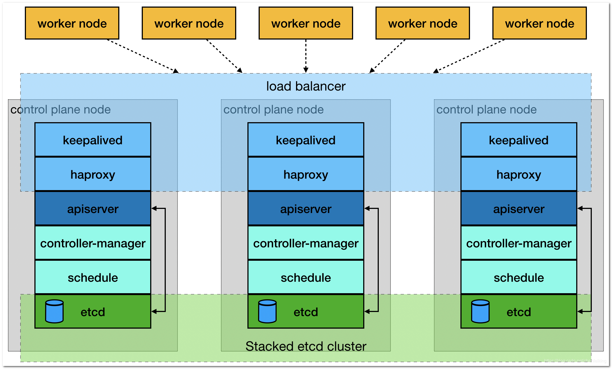
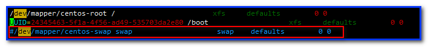

环境介绍：
---
+ CentOS： 7.6
+ Docker： 18.06.1-ce
+ Kubernetes： 1.13.4
+ Kuberadm： 1.13.4
+ Kuberlet： 1.13.4
+ Kuberctl： 1.13.4

部署介绍：
---
创建高可用首先先有一个 Master 节点，然后再让其他服务器加入组成三个 Master 节点高可用，然后再讲工作节点 Node 加入。下面将描述每个节点要执行的步骤：
+ Master01： 二、三、四、五、六、七、八、九、十一
+ Master02、Master03： 二、三、五、六、四、九
+ node01、node02： 二、五、六、九

集群架构：
---


# kuberadm 简介
## Kuberadm 作用
Kubeadm 是一个工具，它提供了 kubeadm init 以及 kubeadm join 这两个命令作为快速创建 kubernetes 集群的最佳实践。

kubeadm 通过执行必要的操作来启动和运行一个最小可用的集群。它被故意设计为只关心启动集群，而不是之前的节点准备工作。同样的，诸如安装各种各样值得拥有的插件，例如 Kubernetes Dashboard、监控解决方案以及特定云提供商的插件，这些都不在它负责的范围。

相反，我们期望由一个基于 kubeadm 从更高层设计的更加合适的工具来做这些事情；并且，理想情况下，使用 kubeadm 作为所有部署的基础将会使得创建一个符合期望的集群变得容易。

## Kuberadm 功能
+ kubeadm init： 启动一个 Kubernetes 主节点
+ kubeadm join： 启动一个 Kubernetes 工作节点并且将其加入到集群
+ kubeadm upgrade： 更新一个 Kubernetes 集群到新版本
+ kubeadm config： 如果使用 v1.7.x 或者更低版本的 kubeadm 初始化集群，您需要对集群做一些配置以便使用 kubeadm upgrade 命令
+ kubeadm token： 管理 kubeadm join 使用的令牌
+ kubeadm reset： 还原 kubeadm init 或者 kubeadm join 对主机所做的任何更改
+ kubeadm version： 打印 kubeadm 版本
+ kubeadm alpha： 预览一组可用的新功能以便从社区搜集反馈

## 功能版本
|Area|Maturity Level|
|:-|:-|
|Command line UX|GA|
|Implementation|GA|
|Config file API|beta|
|CoreDNS|GA|
|kubeadm alpha subcommands|alpha|
|High availability|alpha|
|DynamicKubeletConfig|alpha|
|Self-hosting|alpha|

# 二、前期准备
## 1. 虚拟机分配说明
|IP地址|主机名|内存&CPU|角色|
|:-|:-|:-|:-|
|192.168.2.10|—|—|vip|
|192.168.2.11|k8s-master-01|2C & 2G|master|
|192.168.2.12|k8s-master-02|2C & 2G|master|
|192.168.2.13|k8s-master-03|2C & 2G|master|
|192.168.2.22|k8s-node-02|2c & 4G|node|
## 2. 各个节点端口占用
+ Master节点

|规则|方向|端口范围|作用|使用者|
|:-:|:-:|:-:|:-|:-|
|TCP|Inbound|6443*|Kubernetes API|server All|
|TCP|Inbound|2379-2380|etcd server|client API kube-apiserver, etcd|
|TCP|Inbound|10250|Kubelet API|Self, Control plane|
|TCP|Inbound|10251|kube-scheduler|Self|
|TCP|Inbound|10252|kube-controller-manager|Self|

+ Node节点

|规则|方向|端口范围|作用|使用者|
|:-:|:-:|:-:|:-|:-|
|TCP|Inbound|10250|Kubelet API|Self, Control|plane|
|TCP|Inbound|30000-32767|NodePort Services**|All|

## 3. 基础环境设置
Kubernetes 需要一定的环境来保证正常运行，如各个节点时间同步，主机名称解析，关闭防火墙等等。

主机名称解析
---
分布式系统环境中的多主机通信通常基于主机名称进行，这在 IP 地址存在变化的可能 性时为主机提供了固定的访问人口，因此一般需要有专用的 DNS 服务负责解决各节点主机 不过，考虑到此处部署的是测试集群，因此为了降低系复杂度，这里将基于 hosts 的文件进行主机名称解析。

修改hosts
---
分别进入不同服务器，进入 /etc/hosts 进行编辑
```vim /etc/hosts```
加入下面内容：
```
192.168.2.10    master.k8s.io      k8s-vip
192.168.2.11    master01.k8s.io    k8s-master-01
192.168.2.12    master02.k8s.io    k8s-master-02
192.168.2.13    master03.k8s.io    k8s-master-03
192.168.2.21    node01.k8s.io      k8s-node-01
192.168.2.22    node02.k8s.io      k8s-node-02
```

修改hostname
---
分别进入不同的服务器修改 hostname 名称
```
# 修改 192.168.2.11 服务器
hostnamectl  set-hostname  k8s-master-01
# 修改 192.168.2.12 服务器
hostnamectl  set-hostname  k8s-master-02
# 修改 192.168.2.13 服务器
hostnamectl  set-hostname  k8s-master-03

# 修改 192.168.2.21 服务器
hostnamectl  set-hostname  k8s-node-01
# 修改 192.168.2.22 服务器
hostnamectl  set-hostname  k8s-node-02
```

主机时间同步
---
将各个服务器的时间同步，并设置开机启动同步时间服务
```
systemctl start chronyd.service
systemctl enable chronyd.service
```

关闭防火墙服务
---
> 停止并禁用防火墙
```
systemctl stop firewalld
systemctl disable firewalld
```

关闭并禁用SELinux
---
```
# 若当前启用了 SELinux 则需要临时设置其当前状态为 permissive
setenforce 0

# 编辑／etc/sysconfig selinux 文件，以彻底禁用 SELinux
sed -i 's/^SELINUX=enforcing$/SELINUX=disabled/' /etc/selinux/config

# 查看selinux状态
getenforce 
```
> 如果为permissive，则执行reboot重新启动即可

禁用 Swap 设备
---
kubeadm 默认会预先检当前主机是否禁用了 Swap 设备，并在未用时强制止部署 过程因此，在主机内存资惊充裕的条件下，需要禁用所有的 Swap 设备
```
# 关闭当前已启用的所有 Swap 设备
swapoff -a && sysctl -w vm.swappiness=0
# 编辑 fstab 配置文件，注释掉标识为 Swap 设备的所有行
vi /etc/fstab
```


设置系统参数
---
> 设置允许路由转发，不对bridge的数据进行处理
创建 /etc/sysctl.d/k8s.conf 文件
```vim /etc/sysctl.d/k8s.conf```
加入下面内容:
```
net.ipv4.ip_forward = 1
net.bridge.bridge-nf-call-ip6tables = 1
net.bridge.bridge-nf-call-iptables = 1
```
挂载br_netfilter
```modprobe br_netfilter```
生效配置文件
```sysctl -p /etc/sysctl.d/k8s.conf```
> sysctl命令：用于运行时配置内核参数
查看是否生成相关文件
```ls /proc/sys/net/bridge```

资源配置文件
---
/etc/security/limits.conf 是 Linux 资源使用配置文件，用来限制用户对系统资源的使用
```
echo "* soft nofile 65536" >> /etc/security/limits.conf
echo "* hard nofile 65536" >> /etc/security/limits.conf
echo "* soft nproc 65536"  >> /etc/security/limits.conf
echo "* hard nproc 65536"  >> /etc/security/limits.conf
echo "* soft  memlock  unlimited"  >> /etc/security/limits.conf
echo "* hard memlock  unlimited"  >> /etc/security/limits.conf
```

安装依赖包以及相关工具
---
```
yum install -y epel-release
yum install -y yum-utils device-mapper-persistent-data lvm2 net-tools conntrack-tools wget vim  ntpdate libseccomp libtool-ltdl
```